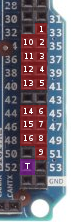
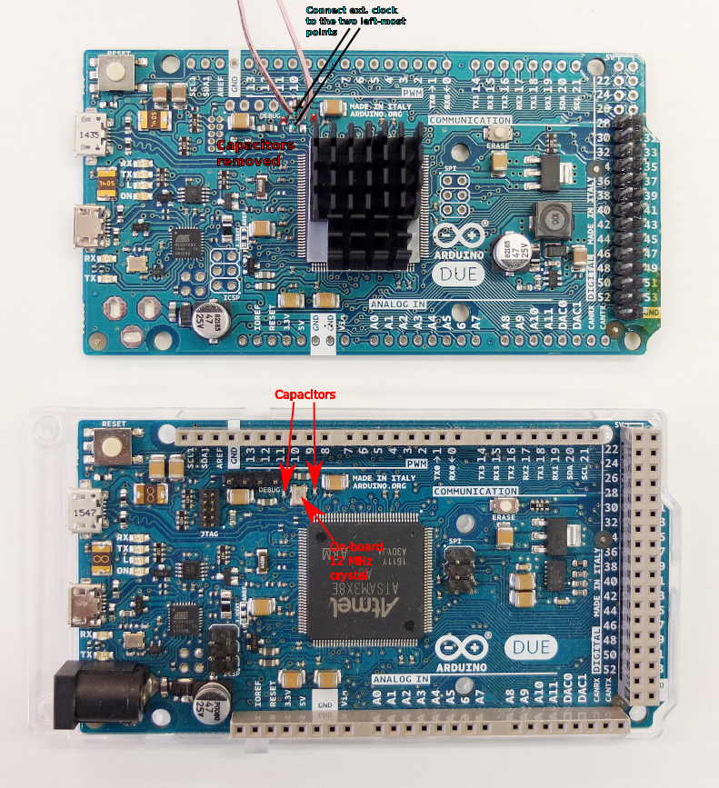

# pulsebox
Arbitrary digital pulse sequence generator with delay-loop timing [(arXiv)](https://arxiv.org/abs/1801.02433)

The software is now in the process of being cleaned up. It will be available **soon**!
In the meantime, we will share the basic concepts here.

## Output channels and trigger pins
The Arduino pins for the output channels are chosen so that they all belong to a single _PIO PORT_ (`PORTC`)



channel | PORTC bit | Arduino pin | channel | PORTC bit | Arduino pin | 
--------|-----------|-------------|---------|-----------|-------------|
   1    |     1     |     33      |    9    |    12     |     51      |
   2    |     3     |     35      |   10    |     2     |     34      |
   3    |     5     |     37      |   11    |     4     |     36      |
   4    |     7     |     39      |   12    |     6     |     38      |
   5    |     9     |     41      |   13    |     8     |     40      |
   6    |    18     |     45      |   14    |    19     |     44      |
   7    |    16     |     47      |   15    |    17     |     46      |
   8    |    14     |     49      |   16    |    15     |     48      |

**Trigger channel:** Arduino pin 52

## The primitive code blocks: output changes and artificial delays
The _output change_ is made by writing into the `REG_PIOC_ODSR` register. For example, to set channels 1 and 2 to `HIGH`, we use the following `C` statement:
```C
REG_PIOC_ODSR = 0b101;
```
The `REG_PIOC_ODSR` bits are mapped to the pulsebox channels according to the pin mapping table shown above. For our example, channel 1 is on bit 1, and channel 2 on bit 3.

Also note that this example is an illustration. In our software implementation, we always write out the full 32-bit value to be written to `REG_PIOC_ODSR`. In the example, we were concerned with two channels with respective `REG_PIOC_ODSR` bits 1 and 3, so we used a three-bit value of `0b101` to set them both to `HIGH`. If we now wanted to set them all to `LOW`, we could write `0b0`. However, this would set _all_ the channels to zero, which was probably not the intention. To avoid this, either use bit masks combined with the bitwise `AND`, `OR`, or `XOR` operations to change only the desired bits of `REG_PIOC_ODSR`, or always explicitly write all the 32 bits of `REG_PIOC_ODSR`.

Without artificial delay, consecutive output changes occur within a two-clock interval (for the default 84 MHz master clock of Arduino Due, this is 24 ns). To modify the duration of the interval, artificial delay is needed. We have devised two ways of controlling the delay between output changes: the _`NOP` approach_, and the _delay-loop approach_.

### NOP delay
By repeatedly using the `NOP` assembly instruction between two output changes, it is possible to increment the delay by one-clock steps (12 ns for the default Arduino clock):
```C
REG_PIOC_ODSR = 0b1;  /* set channel 1 to HIGH */
asm volatile("NOP\n");  /* + 12 ns */
asm volatile("NOP\n");  /* + 12 ns */
asm volatile("NOP\n");  /* + 12 ns */
REG_PIOC_ODSR = 0b0;  /* set channel 1 to LOW */
```
With three `NOP` instructions used in the example, we added three clocks (36 ns) to the always present two-clock (24 ns) interval, making the total duration between output changes 24 ns + 36 ns = 60 ns.

### Delay-loop delay
For longer delays, a certain number of iterations through a _delay loop_ is performed. The higher the iteration count, the longer the delay.

The delay loop can be understood as an empty `C` `for` loop:
```C
REG_PIOC_ODSR = 0b1;  /* set channel 1 to HIGH */

int iters = 10;  /* we will iterate the loop 10 times */
int i;  /* we will hold the current iteration count here */
for(i = 0; i < iters; i++) {
   ;  /* do nothing
}

REG_PIOC_ODSR = 0b0;  /* set channel 1 to LOW */
```
This example would likely not work, because by default, the `C` compiler will try to eliminate useless code (which the delay loop most certainly is).
Our approach relies on the inline assembly implementation of the example above:
```C
REG_PIOC_ODSR = 0b1;  /* set channel 1 to HIGH */

asm volatile (
   "MOVW R1, #0x14\n"  // 20 iterations, approx 1.2 microsec delay
   "MOVT R1, #0x0\n"
   "LOOP0:\n\t"
   "NOP\n\t"
   "SUB R1, #1\n\t"
   "CMP R1, #0\n\t"
   "BNE LOOP0\n"
);

REG_PIOC_ODSR = 0b0;  /* set channel 1 to LOW */
```
#### The `ASM` loop, step by step

1. ```asm volatile(``` begins the `ASM` loop.
2. ```"MOVW R1, #0x14\n"``` moves the bottom 16 bits of the iteration count number to the `R1` general-purpose register. The iteration count in this example is the hexadecimal value `0x14` (20 in decimal).
3. ```"MOVT R1, #0x0\n""``` moves the upper 16 bits of the iteration count number to the `R1` register.
4. ```"LOOP0:\n\t"``` is a _loop label_. After the end of each loop iteration, program execution returns back here, until the number of performed iteration matches the desired iteration count.
5. ```"NOP\n\t"``` is a no-operation instruction.
6. ```"SUB R1, #1\n\t"``` decrements the iteration count by one.
7. ```"CMP R1, #0\n\t"``` compares the iteration count with zero.
8. ```"BNE LOOP0\n"``` returns back to the `LOOP0` loop label, unless the iteration count is zero.
9. ```);``` ends the `ASM` loop.

#### Some important points about the `ASM` loops
* When multiple `ASM` delay loops are used throughout the `.ino` source code, each loop needs to have its unique loop label. We choose to use the `LOOP#` format for the loop labels, with the `#` being a unique number starting from zero and incrementing as loops are added.
* The desired iteration count value can be any 32-bit number (in hexadecimal, `0xffffffff` is the maximum). However, when the 32-bit value is moved to the `R1` register, it needs to be moved in two steps: first, the lower 16-bit portion (with `MOVW`), and then the higher 16-bit portion (with `MOVT`). If the value is a 16-bit number, it is possible to ommit the `MOVT` instruction and use only the `MOVW`, or `MOV` instruction.

#### Alternative versions of the `ASM` loop
Throughout the development of the pulsebox, various `ASM` loops have been devised. You are welcome to experiment with different versions. Differences in the delay-loop granularity, and shortest loop-based pulse, can be expected. Furthemore, when combined with individual `NOP` instructions (for _fine tuning the delay lengths_), there can be some deviation from the trend of one-clock increments. This is most likely due to the MCU instruction prefetching, and/or scheduling. These deviations might also differ based on which version of the delay loop is used.

```C
/* no-NOP loop */
asm volatile(
   "MOVW R1, #0x14\n"
   "MOVT R1, #0\n"
   "LOOP0:\n\t"
   "SUB R1, #1\n\t"
   "CMP R1, #0\n\t"
   "BNE LOOP0\n"
);

/* SUBS, no-NOP loop */
asm volatile(
   "MOVW R1, #0x14\n"
   "MOVT R1, #0\n"
   "LOOP0:\n\t"
   "SUBS R1, #1\n\t"
   "BNE LOOP0\n"
);

/* SUBS, no-NOP, 16-bit only loop */
asm volatile(
   "MOV R1, #0x14\n"
   "LOOP0:\n\t"
   "SUBS R1, #1\n\t"
   "BNE LOOP0\n"
);
```
The manual for the used MCU---with details on the `ASM` instruction set---is a useful reference when playing around with the `ASM` delay loops. Arduino Due is based on the Atmel SAM3X8E MCU. [Here is the link to the datasheet](http://ww1.microchip.com/downloads/en/DeviceDoc/Atmel-11057-32-bit-Cortex-M3-Microcontroller-SAM3X-SAM3A_Datasheet.pdf). The instruction set summary starts on [page 81](http://ww1.microchip.com/downloads/en/DeviceDoc/Atmel-11057-32-bit-Cortex-M3-Microcontroller-SAM3X-SAM3A_Datasheet.pdf#G2.1069810).

## Connecting an external clock source
Locate the onboard quartz oscillator on your board. Remove it, along with the two capacitors on its sides. Four soldering points are left underneath the oscillator. Connect the central pin of a coaxial connector to the upper left one, and the ground of the connector to the lower left one.



The external clock signal should be a unipolar rectangular signal with 3.3 V amplitude and 50 % duty cycle. Its frequency should be in the 3 to 20 MHz range. 12 MHz is the default (the frequency of the onboard oscillator). This frequency is eventually multiplied by a factor of 7, which for a 12 MHz clock source leads to a 84 MHz master clock.
